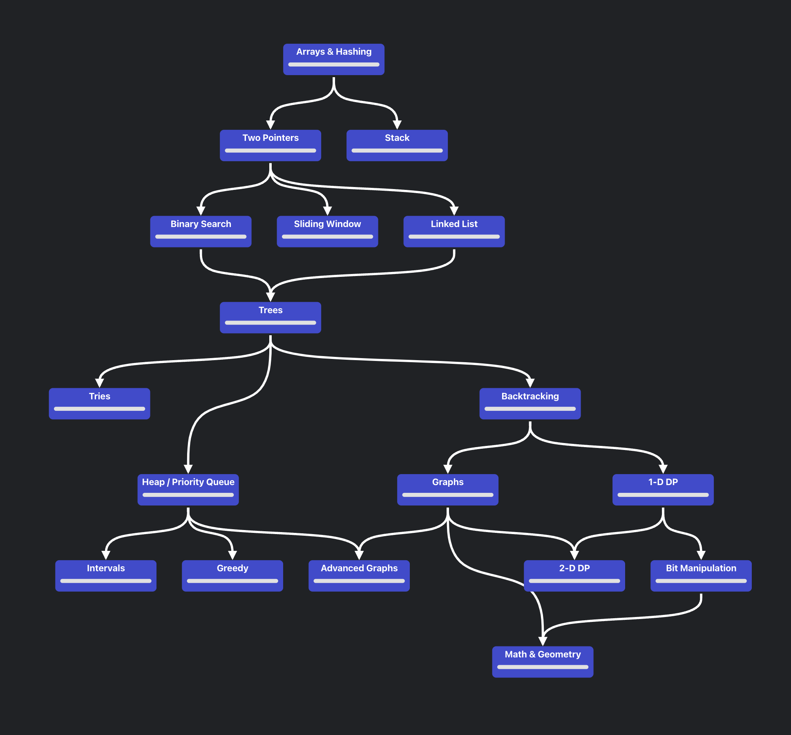

## Roadmap

## 1. Arrays

- [x] 1: [Two Sum](https://leetcode.com/problems/two-sum/) – Easy
- [x] 121: [Best Time to Buy and Sell Stock](https://leetcode.com/problems/best-time-to-buy-and-sell-stock/) – Easy
- [x] 217: [Contains Duplicate](https://leetcode.com/problems/contains-duplicate/) – Easy
- [x] 238: [Product of Array Except Self](https://leetcode.com/problems/product-of-array-except-self/) – Medium 🔴
- [x] 53: [Maximum Subarray](https://leetcode.com/problems/maximum-subarray/) – Easy
- [x] 152: [Maximum Product Subarray](https://leetcode.com/problems/maximum-product-subarray/) – Medium 🔴
- [x] 54: [Spiral Matrix](https://leetcode.com/problems/spiral-matrix/) – Medium
- [x] 56: [Merge Intervals](https://leetcode.com/problems/merge-intervals/) – Medium
- [x] 73: [Set Matrix Zeroes](https://leetcode.com/problems/set-matrix-zeroes/) – Medium
- [x] 33: [Search in Rotated Sorted Array](https://leetcode.com/problems/search-in-rotated-sorted-array/) – Medium
- [x] 209: [Minimum Size Subarray Sum](https://leetcode.com/problems/minimum-size-subarray-sum/) – Medium
- [x] 15: [3Sum](https://leetcode.com/problems/3sum/) – Medium 🔴
- [x] 11: [Container With Most Water](https://leetcode.com/problems/container-with-most-water/) – Medium
- [x] 36: [Valid Sudoku](https://leetcode.com/problems/valid-sudoku/) – Medium
- [x] 49: [Group Anagrams](https://leetcode.com/problems/group-anagrams/) – Medium
- [x] 347: [Top K Frequent Elements](https://leetcode.com/problems/top-k-frequent-elements/) – Medium
- [x] 75: [Sort Colors](https://leetcode.com/problems/sort-colors/) – Medium
- [x] 76: [Minimum Window Substring](https://leetcode.com/problems/minimum-window-substring/) – Hard
- [x] 560: [Subarray Sum Equals K](https://leetcode.com/problems/subarray-sum-equals-k/) – Medium 🔴
- [x] 84: [Largest Rectangle in Histogram](https://leetcode.com/problems/largest-rectangle-in-histogram/) – Hard
- [x] 239: [Sliding Window Maximum](https://leetcode.com/problems/sliding-window-maximum/) – Hard 🔴

## 2. Binary Search

- [x] 704: [Binary Search](https://leetcode.com/problems/binary-search/) – Easy
- [x] 35: [Search Insert Position](https://leetcode.com/problems/search-insert-position/) – Easy
- [x] 69: [Sqrt(x)](https://leetcode.com/problems/sqrtx/) – Easy
- [x] 153: [Find Minimum in Rotated Sorted Array](https://leetcode.com/problems/find-minimum-in-rotated-sorted-array/) – Medium
- [x] 154: [Find Minimum in Rotated Sorted Array II](https://leetcode.com/problems/find-minimum-in-rotated-sorted-array-ii/) – Hard
- [x] 33: [Search in Rotated Sorted Array](https://leetcode.com/problems/search-in-rotated-sorted-array/) – Medium

## 3. Two Pointers & Sliding Window

- [x] 11: [Container With Most Water](https://leetcode.com/problems/container-with-most-water/) – Medium
- [x] 3: [Longest Substring Without Repeating Characters](https://leetcode.com/problems/longest-substring-without-repeating-characters/) – Medium
- [x] 76: [Minimum Window Substring](https://leetcode.com/problems/minimum-window-substring/) – Hard
- [x] 209: [Minimum Size Subarray Sum](https://leetcode.com/problems/minimum-size-subarray-sum/) – Medium
- [x] 567: [Permutation in String](https://leetcode.com/problems/permutation-in-string/) – Medium
- [x] 424: [Longest Repeating Character Replacement](https://leetcode.com/problems/longest-repeating-character-replacement/) – Medium

## 4. Stacks & Queues

- [x] 20: [Valid Parentheses](https://leetcode.com/problems/valid-parentheses/) – Easy
- [x] 155: [Min Stack](https://leetcode.com/problems/min-stack/) – Easy
- [x] 150: [Evaluate Reverse Polish Notation](https://leetcode.com/problems/evaluate-reverse-polish-notation/) – Medium
- [x] 232: [Implement Queue using Stacks](https://leetcode.com/problems/implement-queue-using-stacks/) – Easy
- [x] 739: [Daily Temperatures](https://leetcode.com/problems/daily-temperatures/) – Medium
- [x] 496: [Next Greater Element I](https://leetcode.com/problems/next-greater-element-i/) – Easy

## 5. Linked List

- [x] 206: [Reverse Linked List](https://leetcode.com/problems/reverse-linked-list/) – Easy
- [x] 21: [Merge Two Sorted Lists](https://leetcode.com/problems/merge-two-sorted-lists/) – Easy
- [x] 83: [Remove Duplicates from Sorted List](https://leetcode.com/problems/remove-duplicates-from-sorted-list/) – Easy
- [x] 141: [Linked List Cycle](https://leetcode.com/problems/linked-list-cycle/) – Easy
- [x] 19: [Remove Nth Node From End of List](https://leetcode.com/problems/remove-nth-node-from-end-of-list/) – Medium
- [x] 328: [Odd Even Linked List](https://leetcode.com/problems/odd-even-linked-list/) – Medium
- [x] 23: [Merge k Sorted Lists](https://leetcode.com/problems/merge-k-sorted-lists/) – Hard
- [x] 143: [Reorder List](https://leetcode.com/problems/reorder-list/) – Medium
- [x] 138: [Copy List with Random Pointer](https://leetcode.com/problems/copy-list-with-random-pointer/) – Medium 🔴
- [x] 160: [Intersection of Two Linked Lists](https://leetcode.com/problems/intersection-of-two-linked-lists/) – Easy

## 6. Trees

- [x] 104: [Maximum Depth of Binary Tree](https://leetcode.com/problems/maximum-depth-of-binary-tree/) – Easy
- [x] 98: [Validate Binary Search Tree](https://leetcode.com/problems/validate-binary-search-tree/) – Medium
- [x] 101: [Symmetric Tree](https://leetcode.com/problems/symmetric-tree/) – Easy 🔴
- [x] 102: [Binary Tree Level Order Traversal](https://leetcode.com/problems/binary-tree-level-order-traversal/) – Medium
- [x] 108: [Convert Sorted Array to BST](https://leetcode.com/problems/convert-sorted-array-to-binary-search-tree/) – Easy
- [x] 110: [Balanced Binary Tree](https://leetcode.com/problems/balanced-binary-tree/) – Easy 🔴
- [x] 230: [Kth Smallest Element in a BST](https://leetcode.com/problems/kth-smallest-element-in-a-bst/) – Medium
- [x] 236: [Lowest Common Ancestor of a Binary Tree](https://leetcode.com/problems/lowest-common-ancestor-of-a-binary-tree/) – Medium 🔴
- [x] 297: [Serialize and Deserialize Binary Tree](https://leetcode.com/problems/serialize-and-deserialize-binary-tree/) – Hard 🔴
- [x] 105: [Construct Binary Tree from Preorder and Inorder Traversal](https://leetcode.com/problems/construct-binary-tree-from-preorder-and-inorder-traversal/) – Medium 🔴
- [x] 106: [Construct Binary Tree from Inorder & Postorder](https://leetcode.com/problems/construct-binary-tree-from-inorder-and-postorder-traversal/) – Medium 🔴

## 7. Tries

- [x] 208: [Implement Trie (Prefix Tree)](https://leetcode.com/problems/implement-trie-prefix-tree/) – Medium
- [x] 211: [Design Add and Search Words Data Structure](https://leetcode.com/problems/design-add-and-search-words-data-structure/) – Medium
- [ ] 212: [Word Search II](https://leetcode.com/problems/word-search-ii/) – Hard
- [ ] 421: [Maximum XOR of Two Numbers in an Array](https://leetcode.com/problems/maximum-xor-of-two-numbers-in-an-array/) – Medium
- [ ] 648: [Replace Words](https://leetcode.com/problems/replace-words/) – Medium
- [ ] 676: [Implement Magic Dictionary](https://leetcode.com/problems/implement-magic-dictionary/) – Medium
- [ ] 720: [Longest Word in Dictionary](https://leetcode.com/problems/longest-word-in-dictionary/) – Easy

## 8. Graphs

- [x] 200: [Number of Islands](https://leetcode.com/problems/number-of-islands/) – Medium 🔴
- [ ] 207: [Course Schedule](https://leetcode.com/problems/course-schedule/) – Medium
- [ ] 210: [Course Schedule II](https://leetcode.com/problems/course-schedule-ii/) – Medium
- [ ] 133: [Clone Graph](https://leetcode.com/problems/clone-graph/) – Medium
- [ ] 127: [Word Ladder](https://leetcode.com/problems/word-ladder/) – Medium
- [ ] 269: [Alien Dictionary](https://leetcode.com/problems/alien-dictionary/) – Hard
- [ ] 417: [Pacific Atlantic Water Flow](https://leetcode.com/problems/pacific-atlantic-water-flow/) – Medium
- [ ] 743: [Network Delay Time](https://leetcode.com/problems/network-delay-time/) – Medium
- [ ] 787: [Cheapest Flights Within K Stops](https://leetcode.com/problems/cheapest-flights-within-k-stops/) – Medium

## 9. Heaps & Maps

- [ ] 347: [Top K Frequent Elements](https://leetcode.com/problems/top-k-frequent-elements/) – Medium
- [ ] 215: [Kth Largest Element in an Array](https://leetcode.com/problems/kth-largest-element-in-an-array/) – Medium
- [ ] 692: [Top K Frequent Words](https://leetcode.com/problems/top-k-frequent-words/) – Medium
- [ ] 352: [Data Stream as Disjoint Intervals](https://leetcode.com/problems/data-stream-as-disjoint-intervals/) – Hard

## 10. Backtracking

- [ ] 78: [Subsets](https://leetcode.com/problems/subsets/) – Medium
- [ ] 46: [Permutations](https://leetcode.com/problems/permutations/) – Medium
- [ ] 39: [Combination Sum](https://leetcode.com/problems/combination-sum/) – Medium
- [ ] 79: [Word Search](https://leetcode.com/problems/word-search/) – Medium
- [ ] 131: [Palindrome Partitioning](https://leetcode.com/problems/palindrome-partitioning/) – Medium
- [ ] 17: [Letter Combinations of a Phone Number](https://leetcode.com/problems/letter-combinations-of-a-phone-number/) – Medium
- [ ] 22: [Generate Parentheses](https://leetcode.com/problems/generate-parentheses/) – Medium

## 11. Bit Manipulation

- [ ] 136: [Single Number](https://leetcode.com/problems/single-number/) – Easy
- [ ] 191: [Number of 1 Bits](https://leetcode.com/problems/number-of-1-bits/) – Easy
- [ ] 338: [Counting Bits](https://leetcode.com/problems/counting-bits/) – Medium
- [ ] 231: [Power of Two](https://leetcode.com/problems/power-of-two/) – Easy
- [ ] 190: [Reverse Bits](https://leetcode.com/problems/reverse-bits/) – Easy

## 12. Greedy

- [ ] 55: [Jump Game](https://leetcode.com/problems/jump-game/) – Medium
- [ ] 134: [Gas Station](https://leetcode.com/problems/gas-station/) – Medium
- [ ] 135: [Candy](https://leetcode.com/problems/candy/) – Hard
- [ ] 452: [Minimum Number of Arrows to Burst Balloons](https://leetcode.com/problems/minimum-number-of-arrows-to-burst-balloons/) – Medium

## 13. Dynamic Programming

- [ ] 70: [Climbing Stairs](https://leetcode.com/problems/climbing-stairs/) – Easy
- [ ] 198: [House Robber](https://leetcode.com/problems/house-robber/) – Easy
- [ ] 139: [Word Break](https://leetcode.com/problems/word-break/) – Medium
- [ ] 300: [Longest Increasing Subsequence](https://leetcode.com/problems/longest-increasing-subsequence/) – Medium
- [ ] 322: [Coin Change](https://leetcode.com/problems/coin-change/) – Medium
- [ ] 62: [Unique Paths](https://leetcode.com/problems/unique-paths/) – Medium
- [ ] 63: [Unique Paths II](https://leetcode.com/problems/unique-paths-ii/) – Medium
- [ ] 279: [Perfect Squares](https://leetcode.com/problems/perfect-squares/) – Medium
- [ ] 746: [Min Cost Climbing Stairs](https://leetcode.com/problems/min-cost-climbing-stairs/) – Easy
- [ ] 1143: [Longest Common Subsequence](https://leetcode.com/problems/longest-common-subsequence/) – Medium
- [ ] 72: [Edit Distance](https://leetcode.com/problems/edit-distance/) – Hard

## 14. Intervals

- [ ] 56: [Merge Intervals](https://leetcode.com/problems/merge-intervals/) – Medium
- [ ] 435: [Non-overlapping Intervals](https://leetcode.com/problems/non-overlapping-intervals/) – Medium
- [ ] 253: [Meeting Rooms II](https://leetcode.com/problems/meeting-rooms-ii/) – Medium

## 15. Math & Geometry

- [ ] 50: [Pow(x, n)](https://leetcode.com/problems/powx-n/) – Medium
- [ ] 7: [Reverse Integer](https://leetcode.com/problems/reverse-integer/) – Easy
- [ ] 9: [Palindrome Number](https://leetcode.com/problems/palindrome-number/) – Easy

## 16. Design

- [ ] 146: [LRU Cache](https://leetcode.com/problems/lru-cache/) – Medium
- [ ] 295: [Find Median from Data Stream](https://leetcode.com/problems/find-median-from-data-stream/) – Hard
- [ ] 155: [Min Stack](https://leetcode.com/problems/min-stack/) – Easy
- [ ] 232: [Implement Queue using Stacks](https://leetcode.com/problems/implement-queue-using-stacks/) – Easy
- [ ] 225: [Implement Stack using Queues](https://leetcode.com/problems/implement-stack-using-queues/) – Easy
- [ ] 460: [LFU Cache](https://leetcode.com/problems/lfu-cache/) – Hard
- [ ] 355: [Design Twitter](https://leetcode.com/problems/design-twitter/) – Medium
- [ ] 380: [Insert Delete GetRandom O(1)](https://leetcode.com/problems/insert-delete-getrandom-o1/) – Medium
- [ ] 381: [Insert Delete GetRandom O(1) - Duplicates allowed](https://leetcode.com/problems/insert-delete-getrandom-o1-duplicates-allowed/) – Hard
- [ ] 706: [Design HashMap](https://leetcode.com/problems/design-hashmap/) – Easy
- [ ] 705: [Design HashSet](https://leetcode.com/problems/design-hashset/) – Easy
- [ ] 622: [Design Circular Queue](https://leetcode.com/problems/design-circular-queue/) – Medium
- [ ] 641: [Design Circular Deque](https://leetcode.com/problems/design-circular-deque/) – Medium
- [ ] 173: [Binary Search Tree Iterator](https://leetcode.com/problems/binary-search-tree-iterator/) – Medium
- [ ] 284: [Peeking Iterator](https://leetcode.com/problems/peeking-iterator/) – Medium
- [ ] 341: [Flatten Nested List Iterator](https://leetcode.com/problems/flatten-nested-list-iterator/) – Medium
- [ ] 251: [Flatten 2D Vector](https://leetcode.com/problems/flatten-2d-vector/) – Medium
- [ ] 588: [Design In-Memory File System](https://leetcode.com/problems/design-in-memory-file-system/) – Hard
- [ ] 348: [Design Tic-Tac-Toe](https://leetcode.com/problems/design-tic-tac-toe/) – Medium
- [ ] 359: [Logger Rate Limiter](https://leetcode.com/problems/logger-rate-limiter/) – Easy
- [ ] 362: [Design Hit Counter](https://leetcode.com/problems/design-hit-counter/) – Medium
- [ ] 895: [Maximum Frequency Stack](https://leetcode.com/problems/maximum-frequency-stack/) – Hard
- [ ] 716: [Max Stack](https://leetcode.com/problems/max-stack/) – Easy
- [ ] 1244: [Design A Leaderboard](https://leetcode.com/problems/design-a-leaderboard/) – Medium
- [ ] 1348: [Tweet Counts Per Frequency](https://leetcode.com/problems/tweet-counts-per-frequency/) – Medium
- [ ] 1656: [Design an Ordered Stream](https://leetcode.com/problems/design-an-ordered-stream/) – Easy
- [ ] 432: [All O`one Data Structure](https://leetcode.com/problems/all-oone-data-structure/) – Hard
- [ ] 1381: [Design a Stack With Increment Operation](https://leetcode.com/problems/design-a-stack-with-increment-operation/) – Medium
